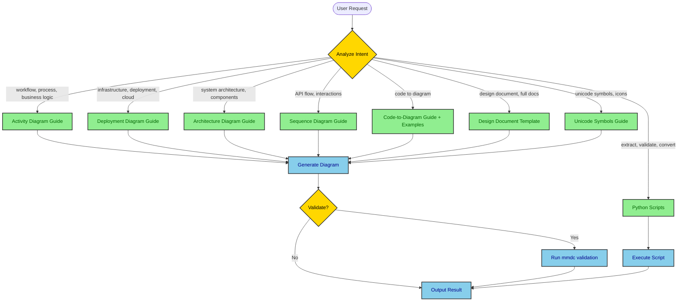
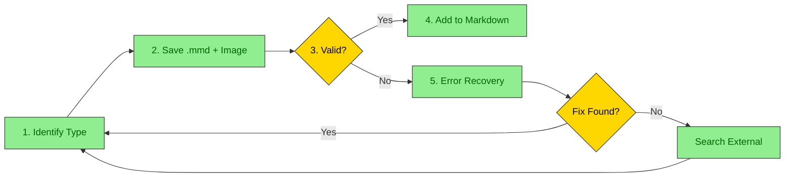

# Mermaid Architect - Operations Process Mapping Skill

Operations process mapping and system diagram skill with specialized guides and on-demand loading.

## Decision Tree

**How this skill works:**

1. **User makes a request** → Skill analyzes intent
2. **Skill determines diagram/document type** → Loads appropriate guide(s)
3. **AI reads specialized guide** → Generates diagram/document using templates
4. **Result delivered** → With validation and export options

**User Intent Analysis:**



## Available Guides and Resources

### Diagram Type Guides

| Guide | Full Path | Load When User Wants |
|-------|-----------|---------------------|
| Activity Diagrams | `$CLAUDE_SKILL_DIR/references/guides/diagrams/activity-diagrams.md` | Workflows, processes, business logic, user flows, decision trees |
| Deployment Diagrams | `$CLAUDE_SKILL_DIR/references/guides/diagrams/deployment-diagrams.md` | Infrastructure, cloud architecture, K8s, serverless, network topology |
| Architecture Diagrams | `$CLAUDE_SKILL_DIR/references/guides/diagrams/architecture-diagrams.md` | System architecture, component design, high-level structure |
| Sequence Diagrams | `$CLAUDE_SKILL_DIR/references/guides/diagrams/sequence-diagrams.md` | API interactions, service communication, request/response flows |

### Code-to-Diagram Guide & Examples

| Resource | Full Path | What It Provides |
|----------|-----------|------------------|
| **Master Guide** | `$CLAUDE_SKILL_DIR/references/guides/code-to-diagram/README.md` | Complete workflow for analyzing any codebase and extracting diagrams |
| **Spring Boot** | `$CLAUDE_SKILL_DIR/examples/spring-boot/README.md` | Controller→Service→Repository architecture, deployment config |
| **FastAPI** | `$CLAUDE_SKILL_DIR/examples/fastapi/README.md` | Python async patterns, Pydantic models, dependency injection |
| **React** | `$CLAUDE_SKILL_DIR/examples/react/README.md` | Component hierarchy, state management, data flow |
| **Python ETL** | `$CLAUDE_SKILL_DIR/examples/python-etl/README.md` | Data pipeline, transformation steps, error handling |
| **Node/Express** | `$CLAUDE_SKILL_DIR/examples/node-webapp/README.md` | Middleware chain, route handlers, async patterns |
| **Java Web App** | `$CLAUDE_SKILL_DIR/examples/java-webapp/README.md` | Traditional MVC, servlet containers, WAR deployment |

### Design Document Templates

| Template | Full Path | Use For |
|----------|-----------|---------|
| Architecture Design | `$CLAUDE_SKILL_DIR/assets/architecture-design-template.md` | System-wide architecture |
| API Design | `$CLAUDE_SKILL_DIR/assets/api-design-template.md` | API specifications |
| Feature Design | `$CLAUDE_SKILL_DIR/assets/feature-design-template.md` | Feature planning |
| Database Design | `$CLAUDE_SKILL_DIR/assets/database-design-template.md` | Database schema |
| System Design | `$CLAUDE_SKILL_DIR/assets/system-design-template.md` | Complete system documentation |

### Unicode Symbols Guide

**Full Path:** `$CLAUDE_SKILL_DIR/references/guides/unicode-symbols/guide.md`

**Load when user mentions:** "unicode symbols", "emoji in diagrams", "semantic icons", "add symbols"

**Quick Reference:**
- 📦 Infrastructure: ☁️ 🌐 🔌 📡 🗄️
- ⚙️ Compute: ⚙️ ⚡ 🔄 ♻️ 🚀 💨
- 💾 Data: 💾 📦 📊 📈 🗃️ 🧊
- 📨 Messaging: 📨 📬 📤 📥 🐰 📢
- 🔐 Security: 🔐 🔑 🛡️ 🚪 👤 🎫
- 📝 Monitoring: 📝 📊 🚨 ⚠️ ✅ ❌

### Python Scripts

| Script | Use For | Load When |
|--------|---------|-----------|
| `extract_mermaid.py` | Extract diagrams from Markdown, validate syntax | "extract diagrams", "validate mermaid" |
| `mermaid_to_image.py` | Convert .mmd to PNG/SVG, batch conversion | "convert to image", "render diagram", "create PNG" |
| `resilient_diagram.py` | Full workflow: save .mmd, generate image, validate, error recovery | "generate diagram", "create diagram with validation" |

For full CLI usage: `$CLAUDE_SKILL_DIR/references/guides/python-utilities.md`

## Usage Patterns

| Pattern | Example Request | Guides to Load |
|---------|-----------------|----------------|
| Single Diagram | "Create activity diagram for login flow" | Diagram type guide + Unicode symbols |
| Code-to-Diagram | "Generate deployment from application.yml" | Framework example + Deployment guide |
| Design Document | "Create API design document" | Template from assets/ + Relevant diagram guides |
| Extract/Validate | "Extract diagrams from design.md" | `scripts/extract_mermaid.py` |
| Batch Convert | "Convert all .mmd to PNG" | `scripts/mermaid_to_image.py` |

For worked examples: `$CLAUDE_SKILL_DIR/references/guides/decision-tree-examples.md`

## Resilient Workflow

**CRITICAL:** Recommended approach for ALL diagram generation.

**Full Guide:** `$CLAUDE_SKILL_DIR/references/guides/resilient-workflow.md`

**Key Principle:** NEVER add a diagram to markdown until it passes validation.



**Error Recovery Priority:**
1. `$CLAUDE_SKILL_DIR/references/guides/troubleshooting.md` (28 documented errors)
2. `perplexity_ask` MCP for syntax questions
3. `brave_web_search` MCP for recent solutions
4. `WebSearch` tool as fallback

## High-Contrast Styling

**ALL diagrams MUST use high-contrast colors with explicit `color:` in every `classDef`:**

```mermaid
graph TB
    classDef primary fill:#90EE90,stroke:#333,stroke-width:2px,color:darkgreen
    classDef secondary fill:#87CEEB,stroke:#333,stroke-width:2px,color:darkblue
    classDef database fill:#E6E6FA,stroke:#333,stroke-width:2px,color:darkblue
    classDef error fill:#FFB6C1,stroke:#DC143C,stroke-width:2px,color:black

    %% Every classDef MUST have color: property
```

**Rules:** Light background → Dark text. Dark background → Light text.

## Workflow Summary

1. **Analyze user intent** → Determine diagram type, document type, or action needed
2. **Load appropriate guide(s)** → Read only what's needed (token efficient)
3. **Apply templates and patterns** → Use examples from guides
4. **Generate output** → Create diagram or document
5. **Validate** (optional) → Use scripts to verify

## When to Use What

| User Request | Load This |
|--------------|-----------|
| "activity diagram", "workflow", "process flow" | `$CLAUDE_SKILL_DIR/references/guides/diagrams/activity-diagrams.md` |
| "deployment", "infrastructure", "cloud", "k8s" | `$CLAUDE_SKILL_DIR/references/guides/diagrams/deployment-diagrams.md` |
| "architecture", "system design", "components" | `$CLAUDE_SKILL_DIR/references/guides/diagrams/architecture-diagrams.md` |
| "API", "sequence", "interactions", "flow" | `$CLAUDE_SKILL_DIR/references/guides/diagrams/sequence-diagrams.md` |
| "Spring Boot code" | `$CLAUDE_SKILL_DIR/examples/spring-boot/` + relevant diagram guides |
| "FastAPI code", "Python API" | `$CLAUDE_SKILL_DIR/examples/fastapi/` + relevant diagram guides |
| "ETL", "data pipeline" | `$CLAUDE_SKILL_DIR/examples/python-etl/` + activity guide |
| "symbols", "unicode", "emoji" | `$CLAUDE_SKILL_DIR/references/guides/unicode-symbols/guide.md` |
| "syntax error", "troubleshoot" | `$CLAUDE_SKILL_DIR/references/guides/troubleshooting.md` |
| "extract diagrams" | `$CLAUDE_SKILL_DIR/scripts/extract_mermaid.py` |
| "convert to image", "PNG", "SVG" | `$CLAUDE_SKILL_DIR/scripts/mermaid_to_image.py` |
| "create diagram", "add diagram to markdown" | `$CLAUDE_SKILL_DIR/scripts/resilient_diagram.py` + resilient-workflow.md |
| "design document", "full docs" | `$CLAUDE_SKILL_DIR/assets/*-design-template.md` + diagram guides |

## Best Practices

1. **Single Responsibility**: One diagram = One concept
2. **Unicode Enhancement**: Always use semantic symbols for clarity
3. **High Contrast**: Never skip the `color:` property in styles
4. **Validate Early**: Use scripts to catch syntax errors
5. **Load On-Demand**: Only read guides needed for the specific request
